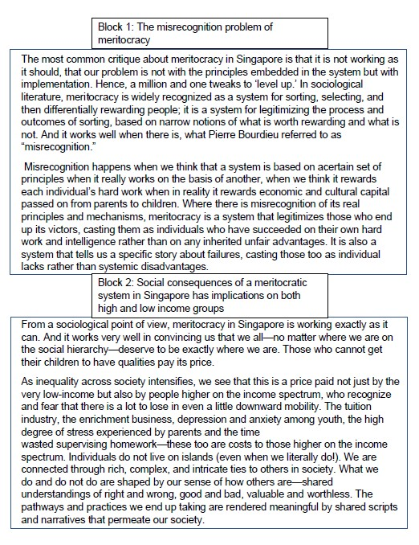

# You Only Read Once 

#### TLDR: We built upon an existing transformer based pretrained model that produces segmented summaries (i.e. it performs text segmentation and summarisation at one shot). If you're not interested in the background or motivations behind our project, feel free to skip straight to the code. 

### Background to this project
This project started of with the intention of wanting to build an application which can help people improve their reading abilities. 
Many current book summarization services such as Blinkist or Audible attempt to bridge this gap by summarizing books into small, bite-sized content easily digestable by modern day consumers who are too busy to afford time reading an entire book. 
However, we believe that reading is still quintessential and there are many benefits wrought by finishing a well-written bound book that cannot be gained simply by reading its summary.  
Can we instead help users to develop a habit of reading faster and more effectively such that reading isn't seen as an imposition on the intricacies of daily routines? We certainly hope that this app would do so. 

### Inspiration for YORO
The idea behind how we would get people to read faster and more effectively was simple: invoke better recall and master the famed "block reading" which many fast readers today employ to devour multiple tens of books a year. As such, our app would have to be able to identify segments in a large chunk of text and perform summarisation on these segments. An example of how this might occur is shown below.  

  

Present NLP paradigms, unfortunately, are a square peg in our circular hole of a problem. Segmentation and further downstream tasks (in our case, summarisation) are often seen as 2 stage problems. 

### How to use this repository 
We have mainly divided up the repo into 2 folders: one folder for data, and the other for developing the models. Will be further updated when we are done!

### Data
All the relevant data used for training is in the data folder. Currently only experiment with the data in the test folder as the rest has not been preprocessed yet.   

### Code
The code folders are still a work in progress. Summarisation has already been created, and segmentation will be up soon.  
